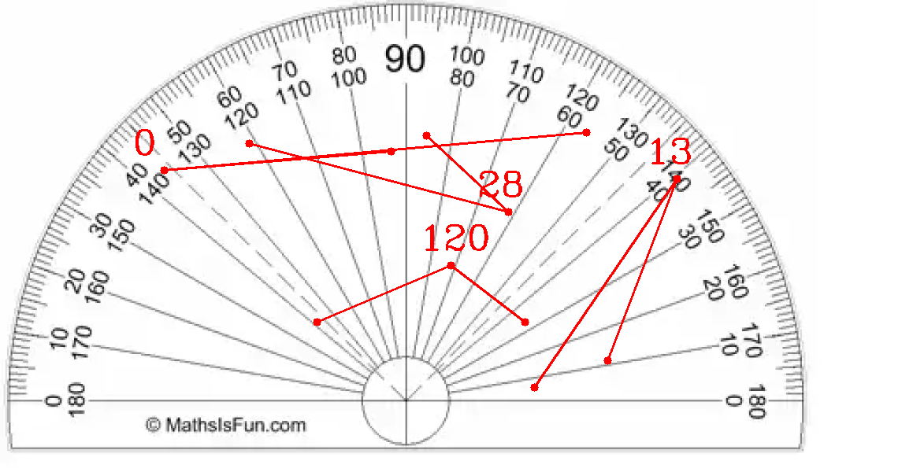

# Angle Measurement Tool


This Python script allows users to measure angles on images, webcam feeds, and videos. It provides a graphical interface where users can mark three points to measure the angle formed by these points.

## Features

- Measure angles on images, webcam feeds, and videos.
- Graphical interface with the ability to mark points using mouse clicks.
- Supports saving annotated images with measured angles.

## Installation

1. Clone this repository to your local machine:

   ```
   git clone https://github.com/your-username/angle-measurement-tool.git
   ```

2. Navigate to the project directory:

   ```
   cd angle-measurement-tool
   ```

3. Install the required dependencies:

   ```
   pip install -r requirements.txt
   ```

## Usage

1. Run the Python script `angle_measurement.py`.
2. Follow the on-screen instructions to select the source for angle measurement (image, webcam, or video).
3. Click on three points to mark the angle you want to measure.
4. Press the 'c' key to clear the markings and start over.
5. Press the 's' key to save the annotated image with measured angles (available only when using images or videos).
6. Press the 'q' key or 'Esc' key to exit the program.

## Requirements

- Python 3.x
- OpenCV (cv2)
- NumPy
- imutils

## File Structure

- `angle_measurement.py`: The main Python script for angle measurement.
- `utils/`: Directory containing utility modules for image, webcam, video handling, and filename generation.
- `result/`: Directory where annotated images with measured angles are saved.


Feel free to adjust the content as needed to better suit your project's details or add any additional information you think is relevant!
